# 📇 Employment Cards

An interactive **employee directory** built with **TailwindCSS** and **vanilla JavaScript**.  
It features searchable employee cards, role-based filtering, and a detailed **CV view** with social media links, achievements, and work experience.

---

## 🚀 Features

- 🔍 Search employees by name or email  
- 🏷️ Filter employees by role (Software Engineer, UI/UX Designer, etc.)  
- 📑 Employee Cards with profile, position, department, and skills  
- 📄 Detailed CV View:
  - Contact information  
  - Social media links  
  - Employment status  
  - Skills  
  - Work experience & achievements  

---

## 📦 Installation & Usage

1. Clone this repo:

   ```bash
   git clone https://github.com/your-username/employment-cards.git
   cd employment-cards
   ```

2. Open the `index.html` file in your browser:

   ```bash
   open index.html
   ```

   *(or double-click `index.html` on Windows)*

✅ No build tools needed — just HTML, CSS, and JS.

## 🖼️ Open in chrome

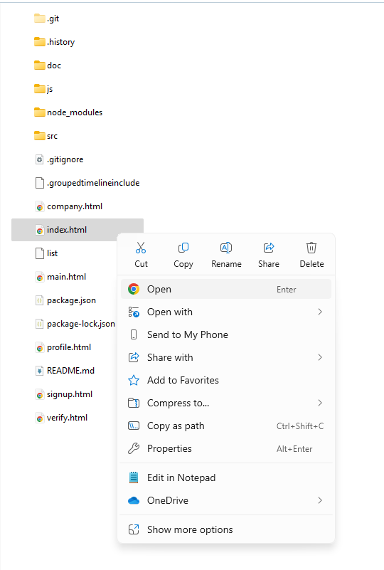


---

## 🖼️ or Download the ZIP File and extract

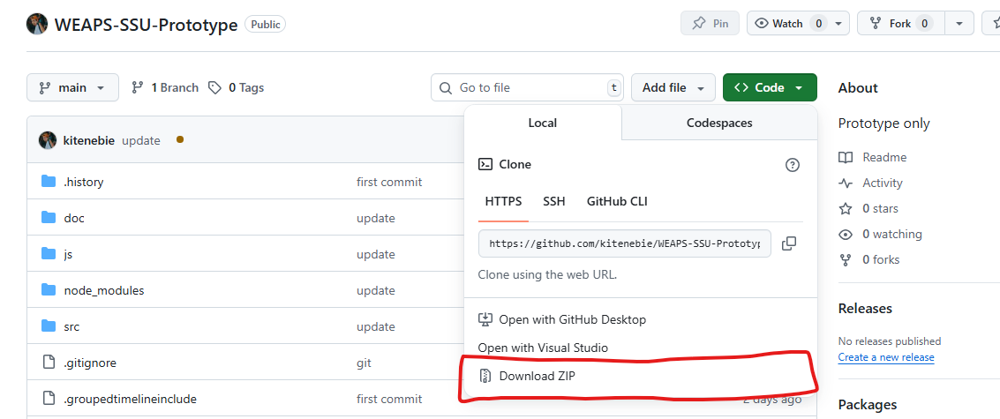


---


## 🖼️ index.html

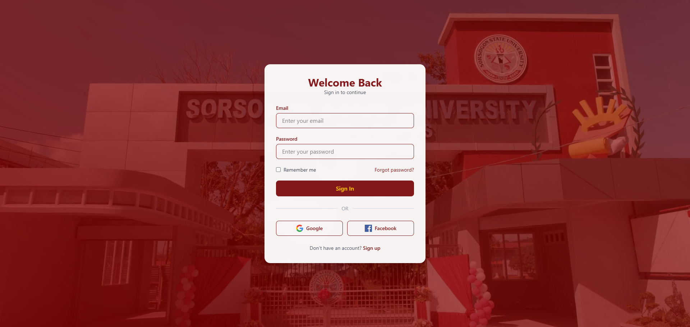

---


## 🖼️ signup.html

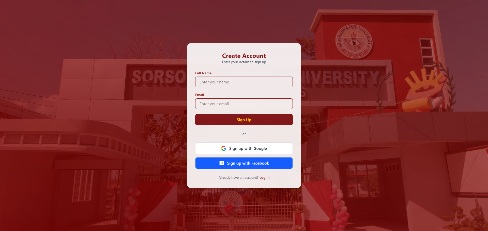

---


## 🖼️ verify.html


---


## 🖼️ main.html

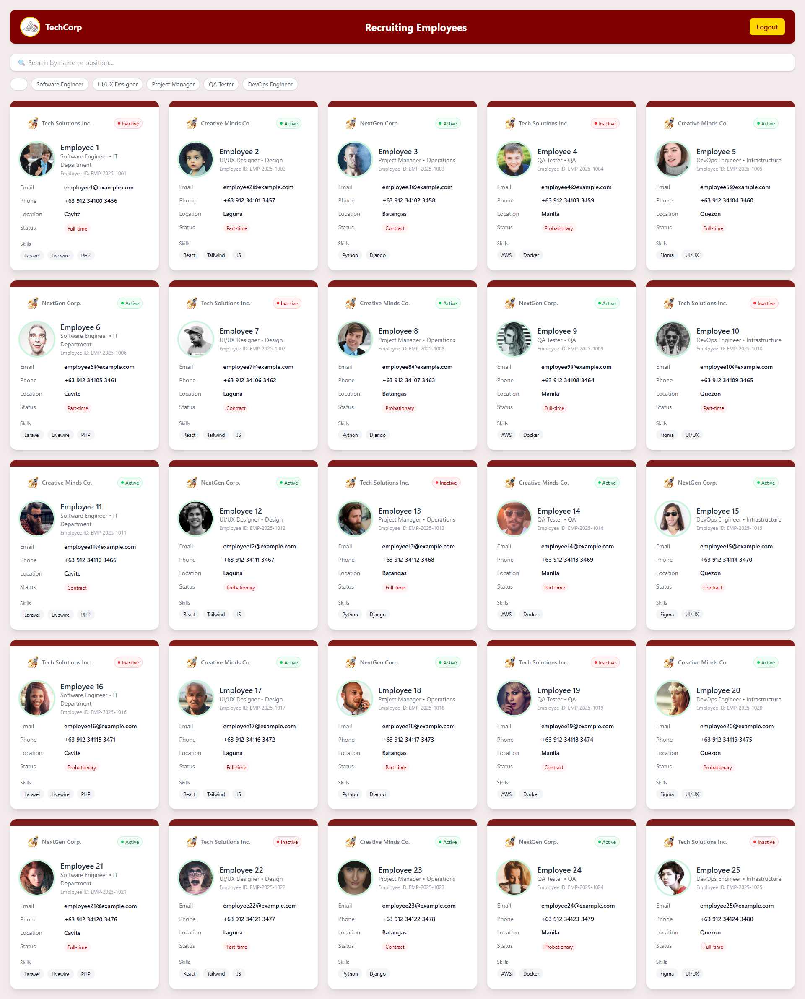


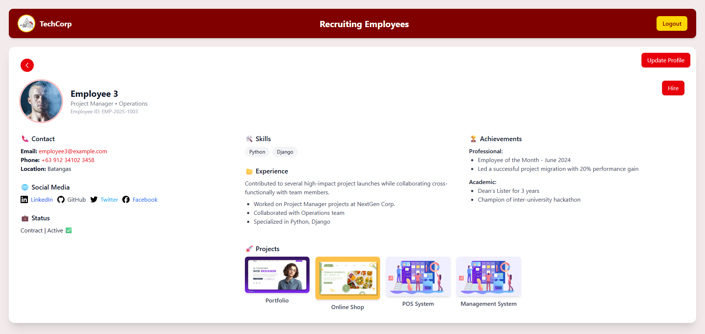


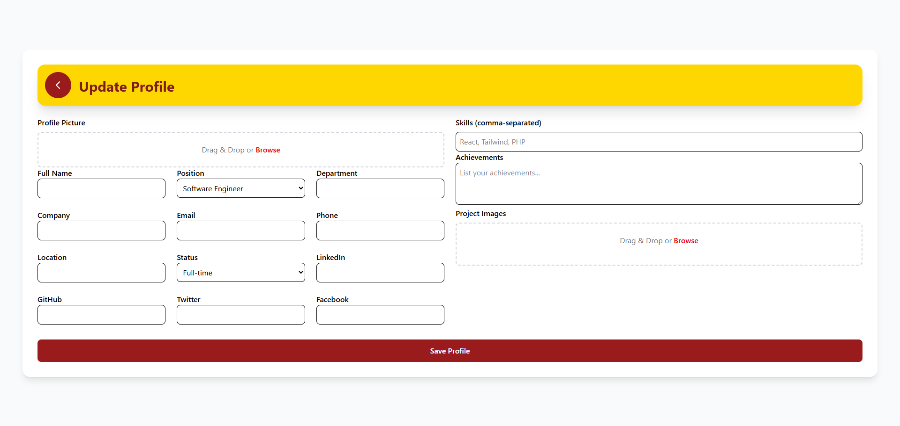


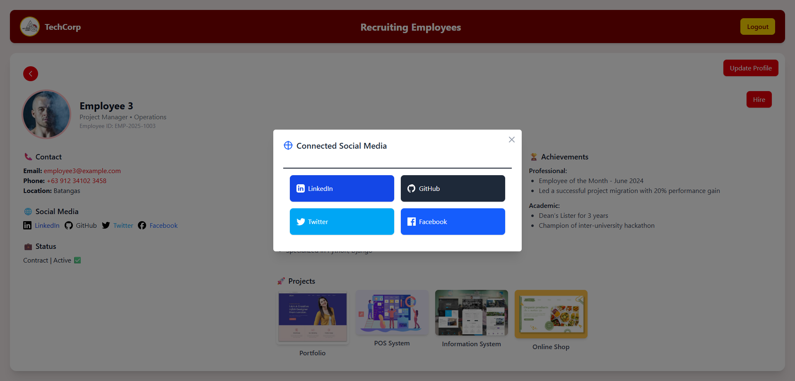

---


## 🖼️ company.html


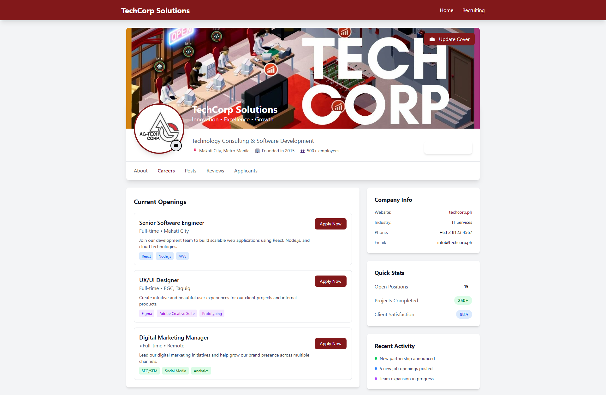


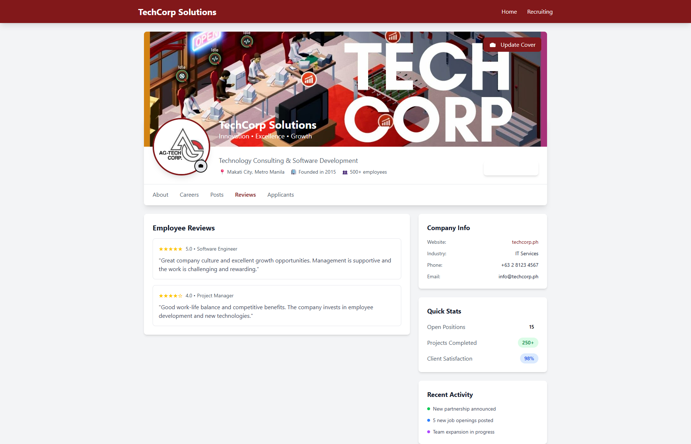


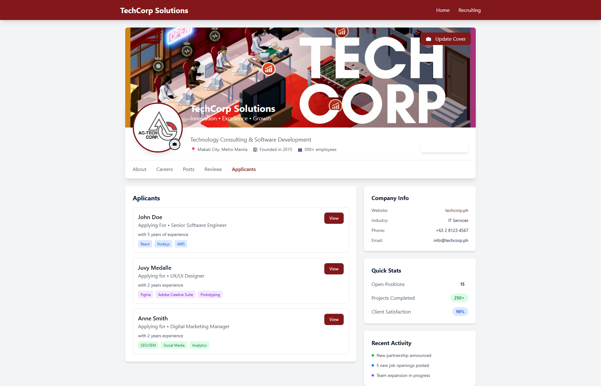

---

## 📌 Roadmap

- [ ] Fetch employee data from an API  
- [ ] Export CV as PDF  
- [ ] Admin dashboard for managing employees  

---

## 📄 License

MIT License © 2025
